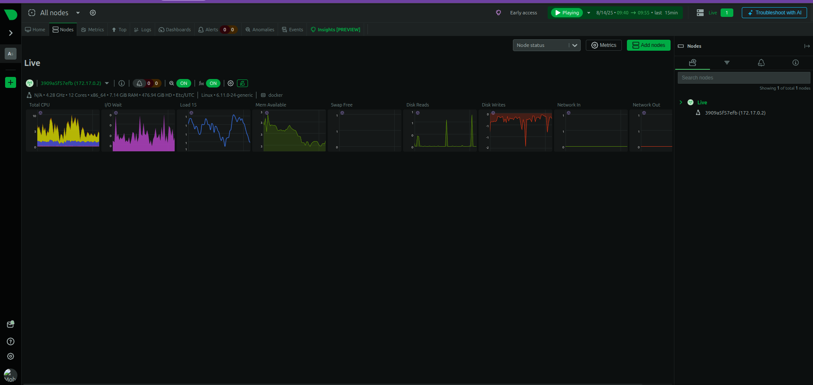

# Netdata System Monitoring

I set up Netdata to monitor my system resources using Docker.

## Commands Used

```bash

# Run Netdata container
docker run -d --name=netdata -p 19999:19999 -v /var/run/docker.sock:/var/run/docker.sock:ro netdata/netdata

# Access dashboard
http://localhost:19999
```

## Dashboard Screenshots

### Metrics


### CPU Metrics  


### Apps Metrics


### Disk Metrics


### Home Dashboard


### System Metrics


### Node Overview


## Features Explored

Real-time Monitoring: Live system metrics updated every second
Web Interface: Clean, responsive dashboard accessible via browser
Multiple Views: Different sections for applications, CPU, disk, and system overview
Docker Integration: Container monitoring with socket access
Alert System: Built-in notifications for system thresholds

## Key Metrics Monitored

CPU utilization and load average
Memory usage and swap activity
Disk I/O operations and space usage
Network traffic and connections
Running processes and applications
Docker container resource consumption

## What I Monitored

I was able to view comprehensive system metrics including CPU performance, memory usage, disk activity, and running applications through the web-based dashboard interface.
